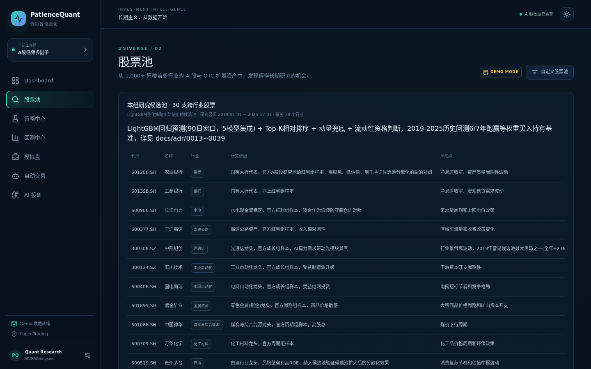
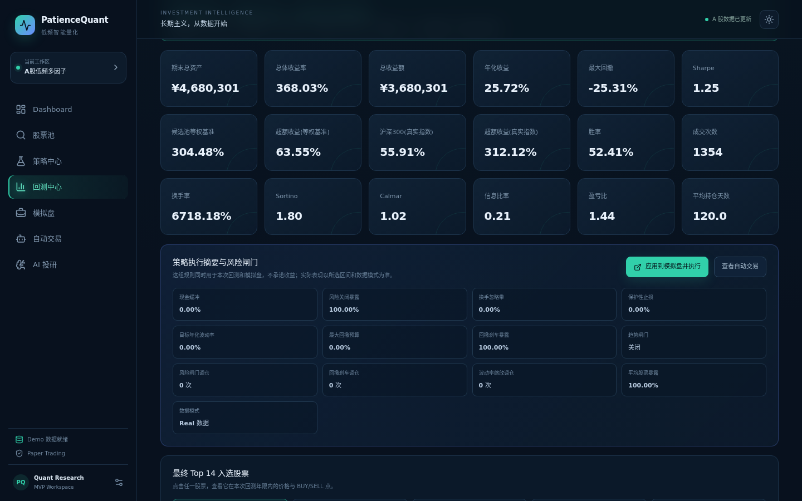
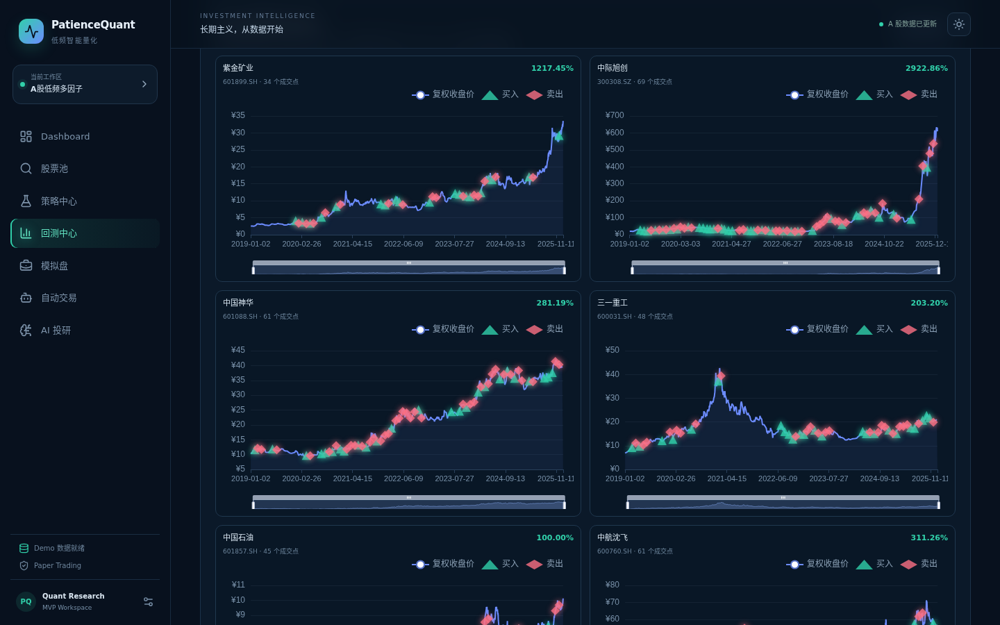
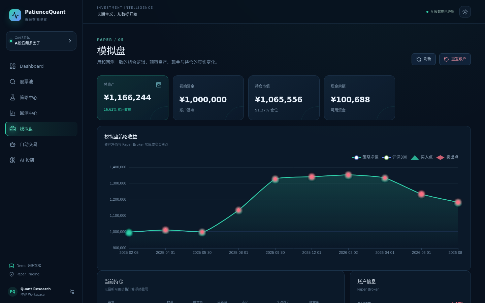
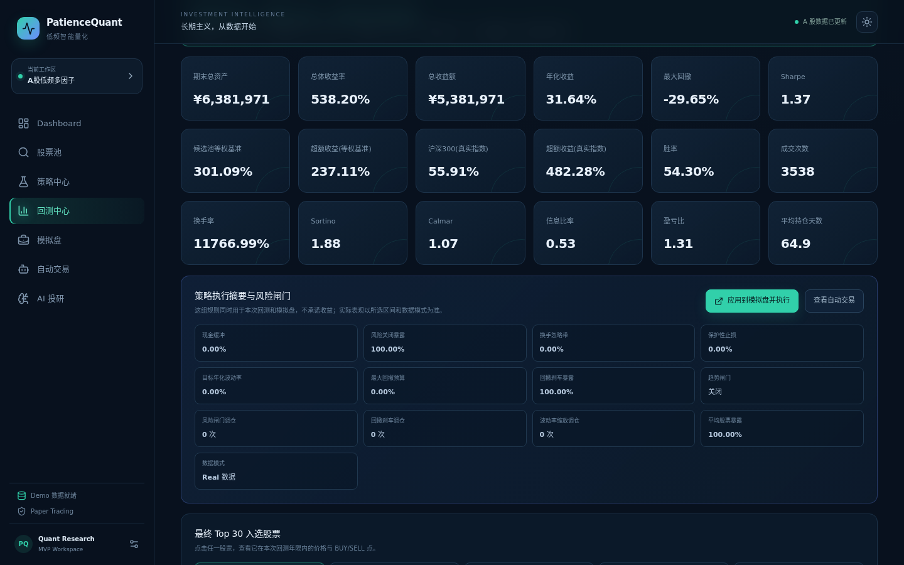
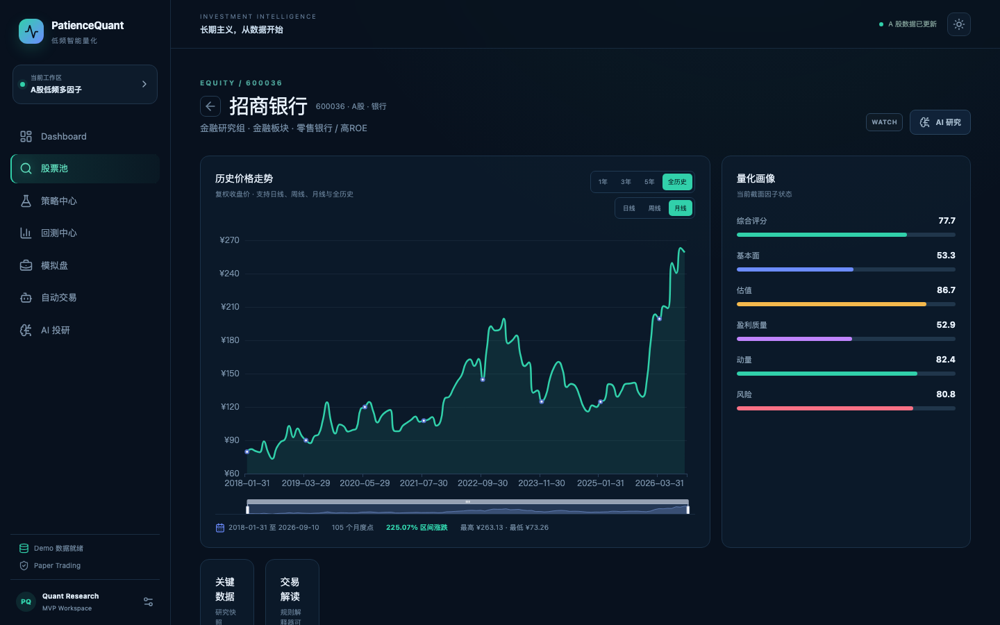

# PatienceQuant · 低频智能量化投资系统

一个面向 A 股长期低频投资的全栈 MVP：

```text
数据 → 股票池 → 多因子策略 → 回测 → 模拟盘 → 自动调仓 → 交易记录 → Dashboard → AI 解释
```

## 快速启动

Docker 后端固定使用 Python 3.11。`make setup` 会优先探测本机 Python 3.11；当前机器若只有 Python 3.9，也会自动兼容回退。前端需要 Node 20+：

```bash
make setup
make backend   # http://localhost:8000
make frontend  # http://localhost:5173
```

或者使用 Docker：

```bash
docker compose up --build
# 浏览器打开 http://localhost:8080
```

**这一步不需要任何前置准备就能起来**：沪深300策略集、30支候选池策略依赖的真实历史数据和训练好的模型文件通过 Git LFS 跟仓库一起分发（`git clone` 会自动带上，需要本机装了 git-lfs），万一这批文件因为某种原因缺失，这几个策略会被自动跳过注册，服务照常启动，通用股票目录（实时连 tushare）、AI 投研、Dashboard 等其它功能都正常可用（ADR-0046）。

**想要这几个真实策略可用，跑一条命令**（详细说明见 [`docs/部署-真实数据准备.md`](docs/部署-真实数据准备.md)）：

```bash
cd backend
pip install -e '.[real-data]'          # 装tushare，如果make setup没装过
bash scripts/prepare_real_data.sh      # 抓真实行情 + 训练模型，几十分钟到数小时不等
```

跑完之后正常重启服务（或者 `docker compose up`——数据目录绑定的是宿主机 `backend/data/`，不需要 `docker cp`）即可让这几个策略生效；生成一次之后长期有效，不用每次部署都重跑。

默认 `DATA_MODE=real`：通用股票目录运行时直接连tushare查询全市场真实代码/名称/行业（`backend/app/data/tushare_provider.py`），不需要预生成任何文件；tushare 连不上时自动回退到本地 50 支真实公司的离线数据（Demo Provider），页面会标记"通用目录 · DEMO MODE"，这个标记只描述这个兜底状态，不影响沪深300策略集和30支候选池策略——它们走独立的真实数据管道，不受这个开关影响。如果想强制离线：

```bash
DATA_MODE=demo make backend
```

## 模块边界

- `backend/app/data`：统一市场数据 Provider 和 SQLite 缓存（脚手架默认多因子策略使用）
- `backend/app/factors`：因子计算、横截面标准化、缺失值填充
- `backend/app/strategies`：策略配置、选股和目标权重
- `backend/app/backtest`：无未来数据泄漏的月度/周度/季度回测
- `backend/app/portfolio`：Paper Trading 账户、订单和成交账本
- `backend/app/ai`：规则解释器和可选 OpenAI-compatible 适配器；API Key/Base URL/模型名可以直接在前端"AI 投研"页面配置并立即生效，不用改 `.env`、不用重启服务（数据库配置优先，没配置过时回退读 `.env`）
- `backend/app/quant_v3`：本组独立开发的真实数据策略——30支候选池的 LightGBM 动量增强策略，以及沪深300全市场（300支真实成分股）的 LightGBM/XGBoost/集成三个已验证策略；走独立 parquet 数据管道，不经过 SQLite 通用目录，不受 `DATA_MODE` 影响
- `frontend/src`：企业级暗色量化 Dashboard

更详细的分模块操作说明（含每个页面的截图）见 [`docs/使用说明.md`](docs/使用说明.md)。

参考项目的复用边界：借鉴 Qlib 的数据/因子/回测分层、FinRL-X 的权重中心契约和 FinRL 的交易/账本思路；不把大型框架整体嵌入产品。

## 演示路径

1. 打开 Dashboard，查看总资产、净值和信号。
2. 在股票池查看两个真实候选池：本组30支跨行业研究池（含逐股入选依据与风险点），以及沪深300全部300支真实成分股（按 LightGBM 最新真实打分排名），下方附行业分布/评分分布/估值成长三张分析图。
3. 在策略中心使用“快速制定策略”设置策略名称、股票池、调仓频率和持仓数量；LightGBM 信号与风险控制默认开启，确有需要时再展开高级设置调整因子和阈值。
4. 在回测中心的策略下拉框里选择——下拉框只展示当前已验证的策略（三个沪深300 LightGBM/XGBoost/集成策略），不会混入未验证或已废弃的策略。
5. 框定研究区间并运行回测，查看最终 Top N、累计/年化收益、回撤、Sharpe、年度收益和完整成交记录。
6. 点击任一入选股票，在独立价格曲线上查看该股票的 BUY/SELL 成交点；组合净值曲线也会标注买卖点。
7. 点击“导出 CSV”下载该回测的完整交易账本，包含日期、代码、名称、市场、研究组、行业、方向、数量、价格、金额、手续费、策略和触发原因。
8. 在自动交易执行一次调仓。
9. 在自动交易页开启按周/月/季度执行的自动调仓；后台轮询到期后会通过 Paper Broker 生成订单。
10. 在模拟盘查看策略净值、BUY/SELL 成交点、持仓、现金、浮动盈亏和订单账本。
11. 在 AI 投研解释一笔 BUY/SELL/HOLD 信号。

## 本组扩展：LightGBM 回归集成策略（30 支跨行业候选池）

在脚手架自带的通用多因子策略之外，本组在这个仓库里实现了一套独立的、真正"以 LightGBM 模型为主体"的低频轮动策略，并把它接入了同一套回测/模拟盘/API：

- **候选池**：`backend/app/quant_v3/broad_universe.py`，30 支覆盖约 28 个行业的 A 股（不再局限于单一大盘股组合），每支股票在股票池页面都有独立标注的入选依据和风险点。
- **信号**：5 个不同随机种子的 LightGBM 回归模型（预测未来 90 个交易日收益率）取平均集成，而不是单一分类模型判 3 档概率。
- **选股**：组内 Top-K 相对排序，而不是绝对分数门槛——避免"模型分数普遍不高但相对最优"的股票被绝对阈值误杀。
- **动量兜底**：独立于模型之外，强制把每期 trailing 60 日动量最强的股票纳入候选，弥补模型在普涨行情里对个别黑马股的误判。
- **流动性资格判断**：按 60 日日均成交额、可交易天数、是否停牌做入选前置过滤。
- **不叠加引擎级止损/波动率/回撤控制**——这层通用风控被验证过是净拖累，本策略默认关闭（详见下方"结果"里的对照）。

这套策略走的是和通用策略共用的 `/api/backtests`、`/api/paper/*` 接口（按策略 `kind` 字段分流数据管道）。

> **现状说明**：这是本组最早跑通的独立策略，仍在股票池页面展示完整研究候选池和入选依据；但回测中心/自动交易的策略下拉框目前只展示下一节"沪深300策略集"里已验证的 3 个策略（`validated` 标志见 `app/quant_v3/csi300_strategies.py::ACTIVE_CSI300_STRATEGIES`），这套 30 支候选池策略暂不在下拉框可选范围内。

### 结果（真实回测，2019-01-01 ~ 2025-12-31，逐年独立回测）

同时对照两条不同性质的基准——**候选池等权基准**（30支候选池等资金买入持有，隔离出"选股/择时"本身相对于"什么都不做"的增量）和**真实沪深300指数**（tushare查的真实指数点位`sh.000300`，回答"整体有没有跑赢大盘"）：

| 年份 | 成交笔数 | 策略收益 | 候选池等权基准 | 超额(等权基准) | 真实沪深300指数 | 超额(真实指数) | 最大回撤 | Sharpe |
|---|---|---|---|---|---|---|---|---|
| 2019 | 164 | +48.24% | +63.51% | -15.26% | +37.95% | +10.29% | -10.74% | 2.20 |
| 2020 | 189 | +88.68% | +64.02% | +24.66% | +25.51% | +63.17% | -19.07% | 2.89 |
| 2021 | 163 | +1.42% | -1.93% | +3.36% | -6.21% | +7.64% | -15.03% | 0.17 |
| 2022 | 172 | -6.69% | -12.59% | +5.90% | -21.27% | +14.59% | -18.19% | -0.26 |
| 2023 | 173 | +12.72% | +8.45% | +4.27% | -11.75% | +24.46% | -12.02% | 0.86 |
| 2024 | 169 | +28.90% | +23.33% | +5.57% | +16.20% | +12.70% | -11.51% | 1.48 |
| 2025 | 147 | +36.60% | +31.37% | +5.23% | +21.19% | +15.41% | -9.02% | 2.20 |

**7 年复合收益：策略 +425.4%，候选池等权基准 +303.9%，真实沪深300指数 +58.9%。**
**vs 候选池等权基准：6/7 个年份跑赢。vs 真实沪深300指数：7/7 个年份跑赢。**

如实说明这个结果的边界，而不是只挑好看的一面讲：

- **两条基准回答的是不同问题，都要看，不能只挑一条**：候选池等权基准剔除了"选对了这30支股票"本身带来的优势，只衡量模型在池子内主动选股/择时的增量——这条基准下 2019 年是唯一的负超额（-15.26 个百分点），说明模型在那一年的相对排序判断确实不如"全部等权拿着不动"；真实沪深300指数衡量的是"整体投入这套策略，是不是比拿着大盘不动更好"——这30支候选池本身长期显著跑赢沪深300指数（一个独立于模型的、"选股票池"层面的优势），这也是为什么两条基准算出来的7年复合收益差这么多（+303.9% vs +58.9%）。
- 诊断过多种假设试图解决"等权基准下2019年跑输"这个问题（拉长动量回看期、粘性持仓、杠杆、多时间尺度融合、基本面特征、市场状态切换……详见开发过程记录），指向的是一个结构性事实：2019 年是近乎普涨的贝塔行情，模型的相对排序在普涨市场里区分度较弱——这不是一个已解决的问题，是诚实报告的已知局限。
- 这是历史区间的回测结果，7 个自然年、30 支股票的样本量，不构成对未来收益的任何保证；模拟盘（Paper Trading）只做本地撮合，不接入真实券商。
- 开发过程中两次被"结果好得不太合理"的直觉倒查出真实系统 bug（基准计算的价格量级偏差、LightGBM 集成模型未开子采样导致 5 个"不同随机种子"训出完全相同的树），修复后的数字比修复前更保守——这两个 bug 修复前的版本曾经短暂报告过更高但错误的收益数字，均已在过程记录里更正。

## 沪深300策略集（当前已验证、生产可用的策略）

在 30 支候选池策略之后，本组进一步把 universe 换成**沪深300全部 300 支真实成分股**——对齐主流量化平台的做法（用可复现、可点位核对的指数成分股作为交易范围，而不是自选池），并逐年独立回测验证了 3 个策略。这 3 个是当前唯一在回测中心 / 自动交易页面下拉框中可选的策略：

| kind | 名称 | 说明（节选自策略描述，原文见 `app/db/seed.py::_CSI300_STRATEGY_LABELS`） |
|---|---|---|
| `csi300_lightgbm` | LightGBM沪深300策略 | LightGBM回归预测(90日窗口，5模型集成) + Top-30相对排序，2019-2025历史回测6/7年跑赢真实沪深300指数，**7年复合+646.9% vs 指数+58.9%** |
| `csi300_xgboost` | XGBoost沪深300策略 | 同一套特征/训练规则，模型换成XGBoost，验证"树模型持续有效"的公开研究结论，**7年复合+620.8% vs 指数+58.9%** |
| `csi300_ensemble` | LightGBM+XGBoost集成沪深300策略 | 两个独立训练的模型预测分数取平均，**7年复合+611.9% vs 指数+58.9%**（略低于单独任一模型，简单平均在两个高度相关的树模型间没有额外增益，如实记录，仍是有效策略） |

如实说明边界：这 3 个策略共用同一套沪深300全市场 universe 和训练/回测规则，同样不叠加引擎级止损/波动率/回撤控制层（`app/quant_v3` 下策略共同的设计，详见上方 30 支候选池策略一节"结果"中对该层被验证为净拖累的说明）；这是历史区间回测结果，不构成未来收益保证。逐年细分数据尚未整理进独立 ADR 文档（代码注释标注"详见 docs/adr 待补"），目前权威数字以 `app/quant_v3/csi300_strategies.py` 和 `app/db/seed.py` 中的策略描述为准。

因为构建 LightGBM/XGBoost 信号源需要一次性加载 70 个模型文件并建立约 90 万行历史数据的索引（冷启动约 5 分钟），服务启动时会在后台线程自动预热一次，通常不会让首个用户等待；预热过程用锁保证同一时间只构建一次，避免并发请求重复构建拖慢/占满内存。

### 界面截图

<table>
  <tr>
    <td valign="top" width="50%">
      <strong>股票池 · 本组研究候选池</strong><br>
      30 支候选股票的真实入选依据与风险点标注（非泛化模板文案）。
      <br><br>
      
    </td>
    <td valign="top" width="50%">
      <strong>回测结果 · 16 项收益/风险/交易指标</strong><br>
      含 Sharpe、Sortino、Calmar、信息比率、盈亏比、平均持有天数等完整指标。
      <br><br>
      
    </td>
  </tr>
  <tr>
    <td valign="top">
      <strong>回测结果 · 逐股买卖点审计</strong><br>
      每支入选股票独立价格曲线，标注真实的模型驱动 BUY/SELL 成交点。
      <br><br>
      
    </td>
    <td valign="top">
      <strong>模拟盘 · 策略净值与持仓</strong><br>
      本地撮合的模拟盘账户，净值曲线随真实调仓记录逐步展开。
      <br><br>
      
    </td>
  </tr>
</table>

## LightGBM 策略信号（脚手架默认策略）

策略中心和回测中心共用同一套模型配置。模型输出三分类概率：`p_up`、`p_down` 和 `p_neutral`；默认使用 `p_up >= 0.60` 且 `p_down <= 0.25` 作为入场参考。回测的最终 Top N 会返回模型概率和 `model_signal`，方便审计每次选股依据。

LightGBM 是可选的生产依赖：

```bash
uv pip install --python .venv/bin/python -e './backend'
```

未安装 LightGBM 时，离线 Demo 会使用确定性的兼容信号模型，页面和回测备注会明确标记模型后端，不会伪造真实模型训练结果。

## 用户体验与结果审计

- 策略中心优先展示少量核心配置，高级参数按需调整。
- 回测中心/自动交易的策略下拉框只展示已验证策略，选中后会展示该策略的介绍文字和研究区间，避免手动来回核对。
- 结果统一展示最终 Top N、累计/年化收益、最大回撤、Sharpe、年度收益、风险闸门和完整成交记录。
- 成交账本可导出 CSV；数据源状态、Demo/Real 模式和模型后端会随结果保留。
- 慢操作（沪深300策略首次冷启动、调仓）有明确的进度反馈和失败原因提示，不会静默复位按钮状态。

## 前端界面预览

以下截图取自当前版本（commit `2aa83b4`）的真实运行状态，`1440×900` 视口。更完整的分模块说明见 [`docs/使用说明.md`](docs/使用说明.md)。

<table>
  <tr>
    <td valign="top" width="50%">
      <strong>Dashboard · 收益与风险总览</strong><br>
      总资产、年化收益、最大回撤、Sharpe、策略/沪深300净值和真实买卖点；右上角只保留一处数据来源标注（系统状态卡片），不再重复展示。
      <br><br>
      
    </td>
    <td valign="top" width="50%">
      <strong>股票池 · 真实策略候选池</strong><br>
      30支跨行业研究池 + 沪深300全部300支真实成分股排名，下附行业分布/评分分布/估值成长三张分析图。
      <br><br>
      
    </td>
  </tr>
  <tr>
    <td valign="top">
      <strong>策略中心 · 快速制定策略与 LightGBM</strong><br>
      先设置策略名称、股票池、调仓频率和持仓数量；LightGBM 信号层与风险控制默认开启，高级参数按需展开。
      <br><br>
      
    </td>
    <td valign="top">
      <strong>回测中心 · 策略下拉框</strong><br>
      策略下拉框只展示当前已验证的沪深300策略；选中后会展示该策略的说明文字与执行口径。
      <br><br>
      
    </td>
  </tr>
  <tr>
    <td valign="top">
      <strong>回测结果 · 沪深300策略真实指标</strong><br>
      16 项收益/风险/交易指标（含候选池等权基准、真实沪深300指数超额收益、Sortino、Calmar、信息比率、盈亏比等），以及风险闸门/回撤刹车触发次数。
      <br><br>
      
    </td>
    <td valign="top">
      <strong>自动交易 · 调仓订单与触发原因</strong><br>
      策略评分 → 组合构建 → 风险控制 → 模拟执行；交易账本记录每笔调仓的方向、数量、金额与来源策略。
      <br><br>
      
    </td>
  </tr>
  <tr>
    <td valign="top">
      <strong>模拟盘 · 资产、现金与持仓收益</strong><br>
      展示策略净值、资金变化、持仓市值、浮动盈亏和成交点，执行模式明确标注 PAPER。
      <br><br>
      
    </td>
    <td valign="top">
      <strong>股票详情 · 多年份价格曲线</strong><br>
      支持 1/3/5 年及全部历史、日/周/月粒度切换，并保留关键价格区间。
      <br><br>
      
    </td>
  </tr>
  <tr>
    <td valign="top">
      <strong>AI 投研 · 可审计的交易解释（不参与交易决策）</strong><br>
      基于评分、因子、行业权重和风险指标生成解释；页面底部明确划定"只解释/建议、不下单"的使用边界。
      <br><br>
      
    </td>
  </tr>
</table>

策略风险预算

默认 V3 不是“保证收益”模型，而是把收益目标和风险约束同时纳入可验证规则：

- 沪深300相对强度 + 动量增强，配合估值/质量的低吸与过热减仓；
- 目标年化波动率、最大回撤预算、回撤刹车暴露可在策略中心修改；
- 当历史组合回撤或滚动波动率达到阈值时，回测和模拟盘都会按同一规则缩小股票暴露；
- 回测结果会记录风险闸门、回撤刹车和波动率缩放的触发次数，实际收益和最大回撤仍以所选区间、交易成本和数据模式为准，未来表现不保证。
