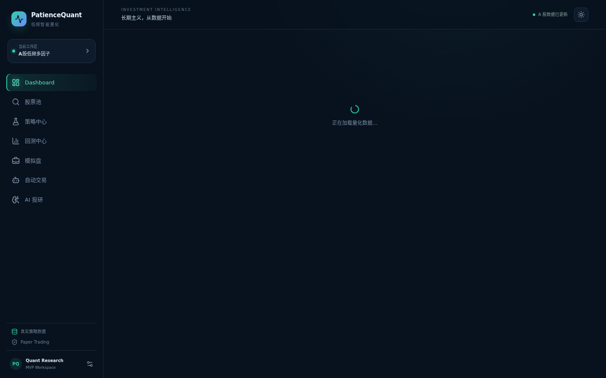
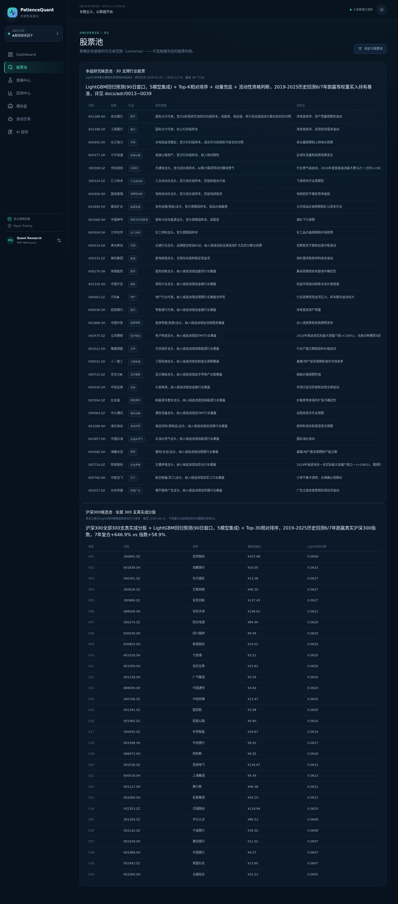
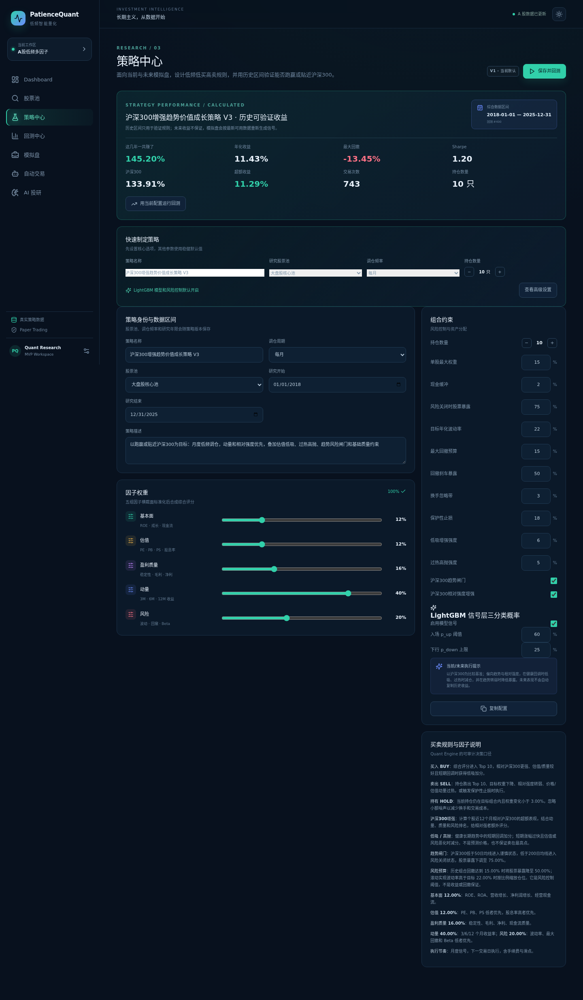
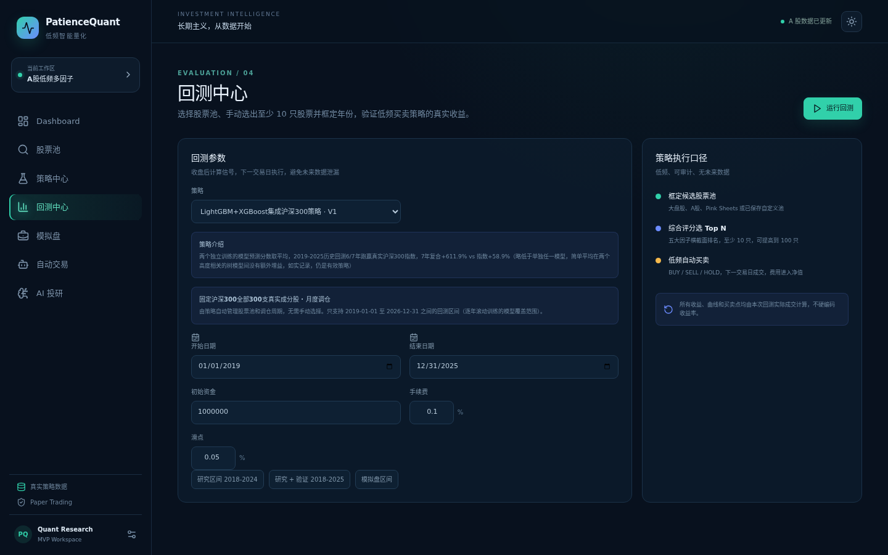
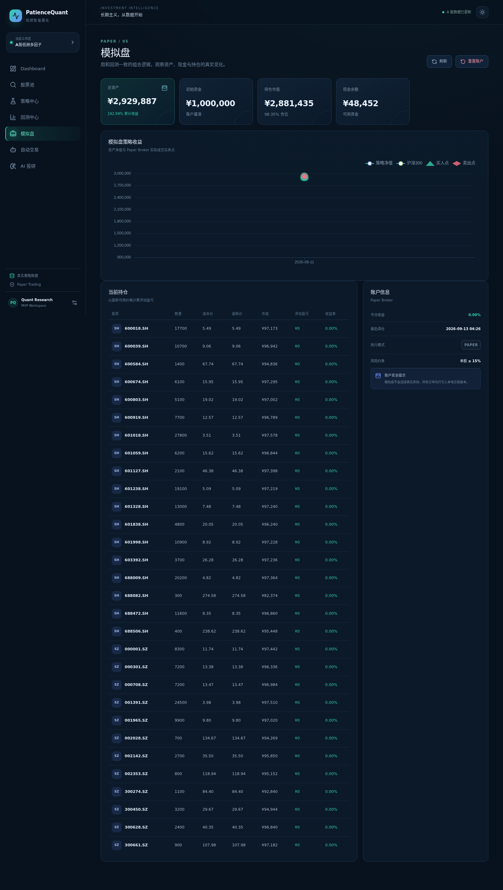
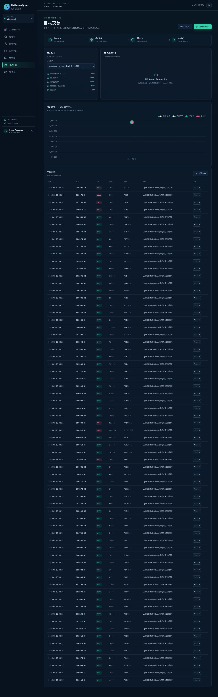
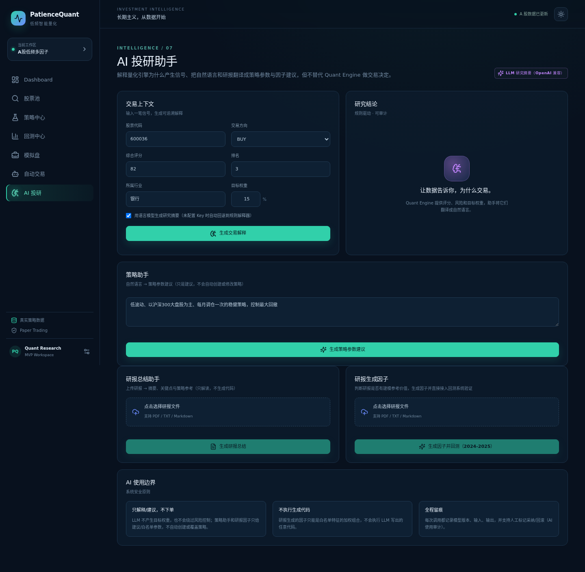

# PatienceQuant 使用说明

低频智能量化系统 —— 面向沪深300的可验证、可审计投资工作台。本说明基于当前代码版本（commit `7315082`）截图，展示每个模块的用途、操作方式，以及贯穿全系统的几个特色设计。

---

## 设计理念

在看具体页面之前，先说清楚这个系统和一般"股票软件"的三点不同，因为它们会反复出现在下面的截图里：

1. **诚实回测，不为了好看调参数。** 所有收益、回撤数字都标注区间和口径（研究区间 / 验证区间 / 模拟盘区间），没有"未来数据"参与信号计算——收盘后算信号、下一交易日才执行，页面上会直接写明这一点。
2. **股票池 = 策略实际可交易范围，不是随便浏览的列表。** 系统的三个已验证策略（LightGBM / XGBoost / 二者集成）统一以**沪深300全部300支成分股**为交易范围，回测结果因此可复现、不存在"自己选出好股票"的幸存者偏差。
3. **明确区分"真实策略数据"和"通用目录 DEMO"。** 系统里两类数据是分开标注的：三个已验证的沪深300策略全程使用真实行情和真实模型打分；另有一个通用股票目录（供自定义股票池等次要功能使用）在当前沙盒网络环境下拿不到实时行情、显示为 DEMO，页面上会用"通用目录 · DEMO MODE"这样的限定词，避免让人误以为整页数据都是假的。

---

## 导航结构

左侧侧边栏共 7 个模块，按"看结果 → 看范围 → 配策略 → 验证策略 → 模拟运行 → 自动执行 → AI 辅助解释"的顺序组织：

```
Dashboard（投资驾驶舱） → 股票池 → 策略中心 → 回测中心 → 模拟盘 → 自动交易 → AI 投研
```

侧边栏底部会动态显示当前数据状态：绑定了真实策略（csi300_lightgbm / csi300_xgboost / csi300_ensemble）时显示"真实策略数据"，否则显示"Demo 数据就绪"——这个标签会随实际绑定状态自动切换，不是写死的。

---

## 1. Dashboard · 投资驾驶舱

首页，一屏看完账户现状、策略净值曲线、最新信号和系统状态。



**看什么：**
- 顶部 5 个指标卡：总资产、策略年化收益、最大回撤、Sharpe、可用现金——年化/回撤/Sharpe 来自最近一次回测结果，不是拍脑袋数字。
- 左侧"策略净值"图：策略净值 vs 沪深300对比曲线，标注真实的买入/卖出点位（来自模拟盘的实际成交，不是示意）。
- 右下"系统状态"卡片：Data Adapter 一行如实显示当前是 `Baostock Real` 还是 `Demo Provider`——这是全站唯一一处数据来源标注，其余页面不重复展示。

**设计要点：** 之前这个页面右上角还有一个独立的黄色 DEMO 徽标，和"系统状态"卡片里的信息完全重复，容易让人误以为整页是假数据。现在已去重，只保留"系统状态"卡片这一个信息源。

---

## 2. 股票池 · Universe

策略实际交易范围的展示页，不是随便逛的选股列表。



**看什么：**
- **本组研究候选池**：30支跨行业股票，用于早期研究策略（LightGBM回归预测 + Top-K相对排序），展示每支股票的研究依据和风险点。
- **沪深300候选池**：全部300支真实成分股，按 LightGBM 最新真实打分排名，表格展示前30名（即策略实际持仓候选）。这是三个已验证策略共同使用的交易范围。
- 底部三张图表：行业分布、评分分布、估值×成长散点——用来快速判断当前候选池的行业集中度和估值健康度。
- 右上角"自定义股票池"：可以自建一个至少10支股票的独立观察池，用于试验 Top-N 低频策略，与上面两个研究池互不影响。

**设计要点：** 之前这里还有一个和真实策略完全脱节的通用大表格（浏览用，不参与任何策略计算），已经删除——现在页面上的每一张表都直接对应某个真实在用的策略范围。

---

## 3. 策略中心 · 策略配置与回顾

查看已验证策略的历史表现，并可视化调整策略参数。



**看什么：**
- 顶部"策略表现"卡片：历史区间收益、超额收益、交易次数、持仓数量，并注明"历史区间只用于验证规则，未来收益不保证"。
- "因子权重"滑块：基本面 / 估值 / 盈利质量 / 动量 / 风险五个维度可视化调节，权重自动归一化到100%。
- "组合约束"面板：持仓数量、单股最大权重、择时降仓比例、换手阈值、是否启用沪深300趋势择时。
- 真实行情下只有动量、风险两组因子有真实数据，其余三组按 0 权重计算（页面有说明）。

**怎么用：** 调整完参数后点击"用当前配置运行回测"直接跳转验证效果，不需要手动去回测中心重新填一遍表单。

---

## 4. 回测中心 · 历史验证

选定策略和时间区间，运行一次完整回测。



**看什么：**
- 策略下拉框：**只列出当前有效、经过验证的策略**（LightGBM+XGBoost集成沪深300策略等），不会把开发中或已废弃的策略混进来让用户误选。
- 策略下方会显示这个策略的"策略介绍"说明文字，以及是否使用固定的沪深300全市场股票池。
- 右侧"策略执行口径"栏：框定候选股票池 → 综合评分选 Top N → 低频自动买卖，强调"所有收益、曲线和买卖点均由本次回测实际交易复算，不硬编码收益率"。
- 底部有"研究区间 / 研究+验证区间 / 模拟盘区间"三个快捷日期按钮，避免手动改日期时踩到某个策略只支持特定年份范围的坑。

**设计要点：** 沪深300集成策略首次被使用时需要加载70个模型文件并建立索引，冷启动较慢；系统会在服务启动时后台预热一次，一般不会让用户等待。若确实运行较久，按钮会显示"正在回测…(Ns)"的计时器，而不是让人以为卡死了。

---

## 5. 模拟盘 · Paper Trading

和回测口径完全一致的模拟账户，观察真实的资产、现金与持仓变化。



**看什么：**
- 顶部4个卡片：总资产、初始资金、持仓市值、现金余额，累计收益率一目了然。
- "模拟盘策略收益"图：资产净值曲线，叠加真实的 Paper Broker 成交买卖点。
- "当前持仓"表：每支股票的数量、成本价、最新价、市值、浮动盈亏、收益率——按最新可用价格实时计算浮盈。
- 右侧"账户信息"：执行模式明确标注 `PAPER`（区别于真实交易），并提示"模拟盘不会连接真实券商，所有订单只写入本地交易账本"。

---

## 6. 自动交易 · 策略调仓执行

选择策略、配置风控规则，一键触发一次调仓。



**看什么：**
- 顶部流程图：策略决策 → 组合构建 → 风控校验 → 模拟执行，四步走完成一次调仓，每一步都可审计。
- "执行配置"卡片：策略下拉框同样只显示已验证策略；下方逐项列出本次调仓会检查的风控项（单股最大权重、目标波动率、最大回撤限制、模拟模式开关等）及 PASS/OFF 状态。
- "交易账本"表：详细记录每一笔调仓产生的 BUY/SELL、数量、金额，以及来源策略，支持导出 CSV。

**设计要点：** 沪深300集成策略调仓涉及全市场300支股票评分计算，耗时可能较长；调仓按钮已配合服务端超时和错误提示优化，失败时会明确告知原因（而不是按钮默默复位、让人误以为是网络或浏览器切标签导致的）。

---

## 7. AI 投研 · 辅助解释（不参与交易决策）

用自然语言解释信号、生成策略参数建议，明确划定"只解释、不下单"的边界。



**看什么：**
- 右上角"API 设置"：配置 OpenAI Key / Base URL / 模型名称，保存后立即生效，不用改 `.env`、不用重启服务；数据库里的配置优先，没配置过时回退读部署环境的 `.env` 默认值。
- "交易上下文"：输入一笔真实信号（代码、方向、评分、排名、目标权重），生成可追溯的自然语言解释。
- "策略助手"：用自然语言描述想要的策略风格（比如"低波动、以沪深300大盘股为主、每月调仓一次"），生成参数建议——仅供参考，不会自动创建或修改策略。
- "研报总结助手" / "研报生成因子"：上传研报文件，生成摘要或候选因子，因子可直接接入回测系统验证，但不会执行研报里的任意代码。
- 底部"AI 使用边界"三张说明卡是这个模块最重要的设计：**只解释/建议、不下单**；**不执行生成代码**；**全程留痕**（每次调用都记录模型版本、输入输出，支持人工审核）。这是为了确保 LLM 不会绕过风控直接影响真实资金决策。

---

## 小结：贯穿全系统的几个设计原则

| 原则 | 体现位置 |
|---|---|
| 诚实回测，不隐藏坏结果 | 策略中心/回测中心统一标注"历史区间只用于验证规则，未来收益不保证" |
| 真实数据来源如实标注 | Dashboard "系统状态"卡片、DEMO 徽标带"通用目录"限定词 |
| 股票池即策略真实交易范围 | 股票池页面只保留有真实策略在用的候选池 |
| 只展示已验证策略 | 回测中心 / 自动交易 的策略下拉框都过滤未验证策略 |
| 慢操作要有明确反馈 | 回测按钮计时器、失败时的具体错误提示（而非静默复位） |
| AI 辅助不越权 | AI 投研模块的"只解释/建议、不下单"边界 |
