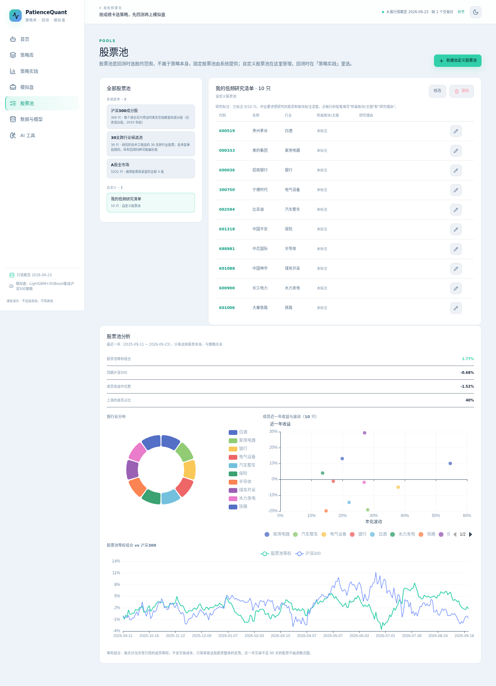
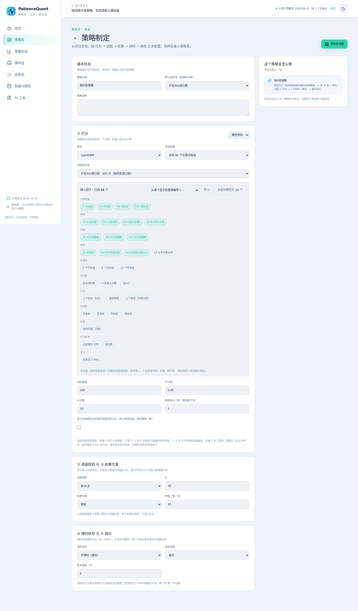
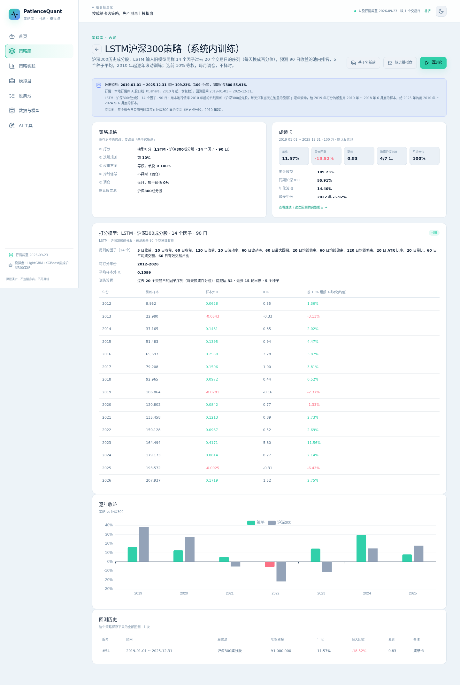
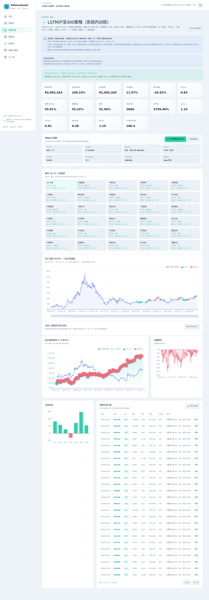
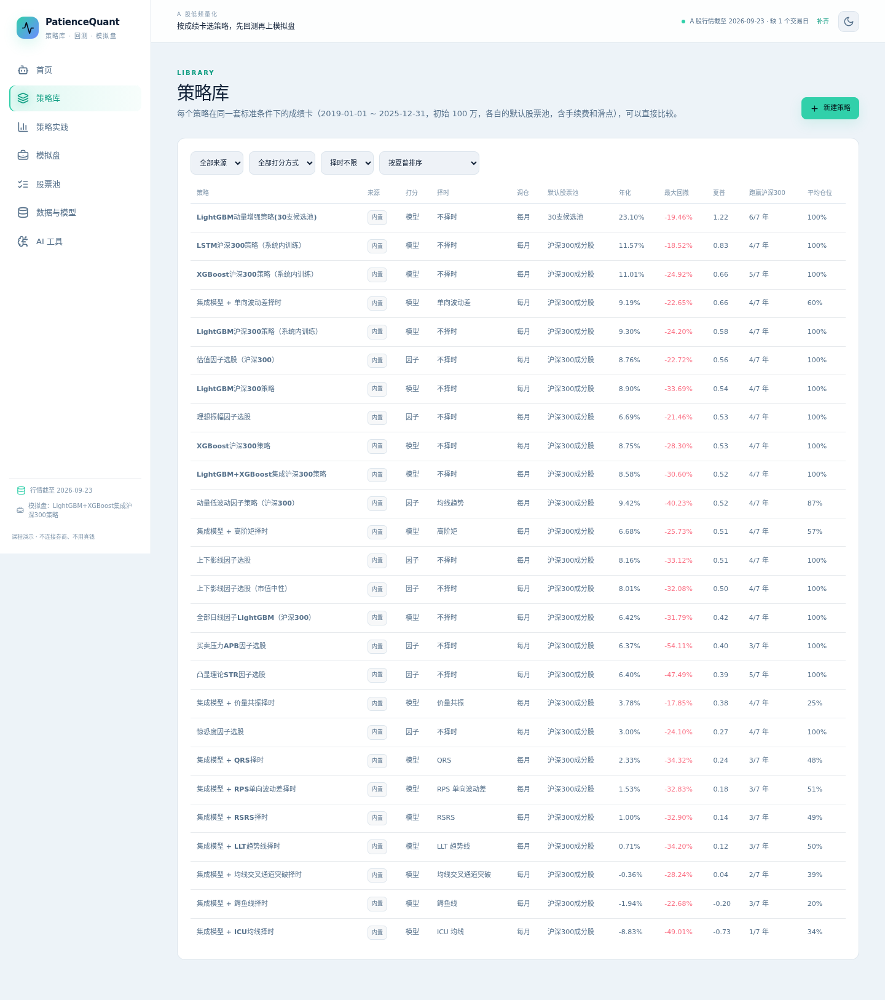
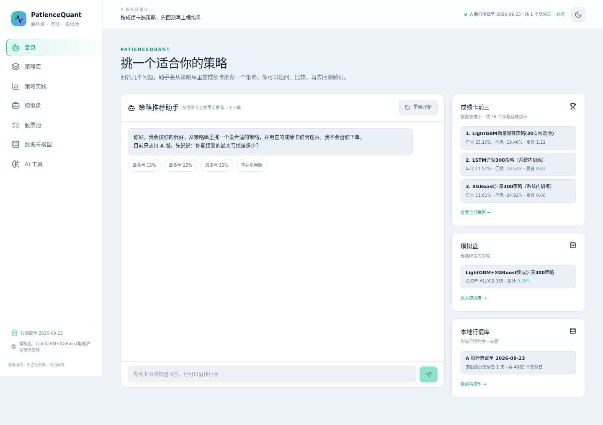
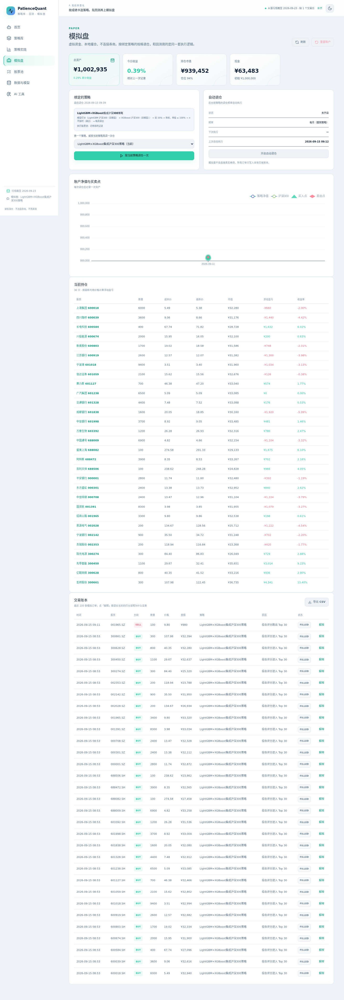
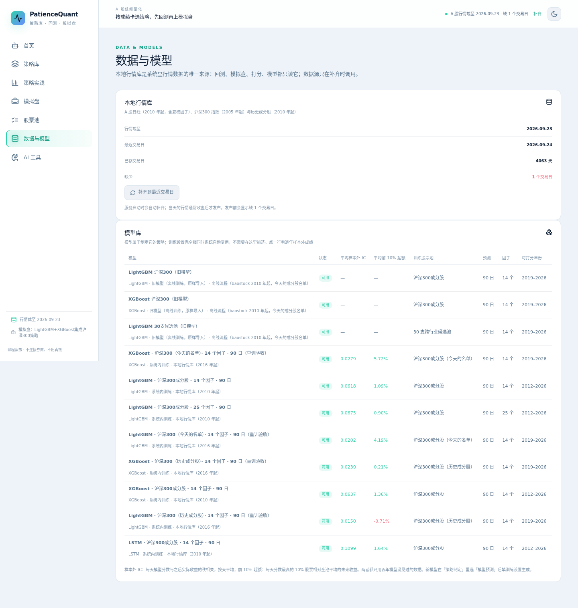

# PatienceQuant 使用说明与演示脚本

低频 A 股量化演示系统：股票池 → 制定策略（因子权重或模型，可在系统里训练）→ 成绩卡与回测报告 → 模拟盘自动调仓 → 交易记录与持仓收益。不连接券商，不用真钱。

截图在 `docs/screenshots/v2/`，1440×900 视口。

---

## 演示脚本（约 15 分钟）

按作业要求的顺序走一遍：研究的股票和板块 → 自己的策略（写清楚用了哪几年的数据、赚了多少个点）→ 智能化交易与模拟盘 → 持仓收益变化、交易记录、股票池分析。

### 第 1 步：股票池与研究标注（2 分钟）

1. 左侧点 **股票池**，选 **我的低频研究清单**（本组研究的 10 只股票）。
2. 表格里每只股票有 **所属板块/主题** 和 **研究理由** 两列，点每行右边的铅笔填写、保存。作业要求"把研究的股票和板块标注清楚，最少十个"就在这里体现。
3. 往下看 **股票池分析**（作业里的"池塘分析"）：按板块（没标注时按行业）分布的饼图、成员近一年收益与波动散点、股票池等权组合对沪深300 的走势。

### 第 2 步：制定并训练自己的策略（4 分钟）

1. **策略库** → 右上角 **新建策略**。
2. 在 **① 打分** 右侧选 **模型预测**，填训练设置：算法（LightGBM / XGBoost / LSTM）、预测周期、训练股票池、输入因子（可以"从某个因子权重策略导入"）、种子个数。
3. 设好选股、权重、择时、调仓，点 **保存并训练**。模型在后台训练（沪深300、2010 年起的数据：LightGBM/XGBoost 约 1.5～6 分钟，因子越多越慢；LSTM 约 5 分钟），训练好后自动算成绩卡；训练设置和已有模型完全相同时直接沿用，不重复训练。
4. 也可以选 **因子权重**：拖动因子组权重，或"从因子库添加单个因子"（价量、估值、换手率、市值、行为金融等）。

### 第 3 步：看成绩卡——用了哪几年的数据、赚了多少个点（3 分钟）

1. 打开刚建的策略（或内置的 **LSTM沪深300策略（系统内训练）**）。
2. 顶部 **数据说明** 写明：行情数据从哪年开始、模型用哪几年的数据训练（逐年滚动，给 Y 年打分的模型只用 Y−1 年 6 月底前的数据）、回测区间，以及累计收益"多少个点"和同期沪深300。
3. 下面是成绩卡（标准条件：2019–2025、100 万、默认股票池、含手续费和滑点）、打分模型的输入因子和逐年样本外成绩、逐年收益对沪深300。
4. 点 **查看成绩卡这次回测的完整报告**：净值与回撤、入选股票与个股买卖点、完整交易账本（可导出 CSV），每笔成交可点"解释"。

### 第 4 步：策略库与智能体推荐（2 分钟）

1. **策略库**：全部策略在同一套标准条件下的成绩卡，按夏普、年化、回撤排序，按来源、打分方式、择时筛选。
2. **首页** 的智能体：回答"能接受的最大回撤""多久调一次仓"，它按成绩卡推荐一个策略，列出筛选规则和备选；可以追问"为什么不是某个策略""比较两个策略"。数字只来自成绩卡，智能体不下单。

### 第 5 步：模拟盘自动交易（3 分钟）

1. 在策略详情点 **放进模拟盘**：模拟盘绑定这个策略并立即调仓。
2. **模拟盘** 页打开 **自动调仓**：后台按策略的调仓频率自动执行；择时信号每天收盘判断、次日调整仓位。
3. 看 **账户净值与买卖点**（持仓收益变化）、**当前持仓**（每只股票的浮动盈亏）、**交易账本**（自动交易记录，每笔可"解释"，可导出 CSV）。

### 第 6 步：数据与模型（1 分钟）

**数据与模型** 页：本地行情库（A 股日线 2010 年起、每日指标、沪深300 指数与历史成分股）的状态与补齐；模型库里每个模型的状态、训练进度（可取消）、逐年样本外 IC 与前 10% 超额。

---

## 页面一览

| 页面 | 做什么 |
|---|---|
| 首页 | 智能体按成绩卡推荐策略，只解释、不下单 |
| 策略库 | 全部策略的成绩卡对比 |
| 策略详情 | 数据说明、策略规格、成绩卡、打分模型或用到的因子、逐年收益、回测历史 |
| 策略制定 | 打分 → 选股 → 权重 → 择时 → 调仓；模型策略在这里填训练设置并训练 |
| 策略实践 | 选策略，换区间、资金、股票池、费用做回测 |
| 回测报告 | 指标、净值、个股买卖点、交易账本与解释 |
| 模拟盘 | 绑定策略、手动/自动调仓、净值、持仓、订单账本 |
| 股票池 | 固定股票池与自定义股票池、研究标注、股票池分析 |
| 数据与模型 | 本地行情库、模型库 |
| AI 工具 | 研报总结、大模型设置 |

## 贯穿全系统的原则

| 原则 | 体现 |
|---|---|
| 不偷看未来 | 收盘算信号、次日执行；沪深300 按当时的历史成分股；模型逐年滚动训练 |
| 好坏结果都如实报告 | 成绩卡与 ADR 记录每一次对比和消融，包括不如指数的策略 |
| 数据可追溯 | 每个策略的数据说明；每个模型的训练设置与逐年样本外成绩 |
| AI 不越权 | 智能体只按成绩卡规则推荐并解释，回答里的数字必须来自成绩卡；不下单、不改策略 |
