# 演示轨迹：一个用户第一次使用 PatienceQuant

模拟一个普通用户从头到尾正常使用系统：问智能体、看股票池、翻策略库、自己制定并训练一个模型策略、看成绩卡和回测报告、换条件再回测、放进模拟盘自动交易。

- **环境**：隔离的演示环境（真实数据库和模型库的副本，另起一套前后端）。行情库只读共用，所以轨迹里的操作不会改动真实系统。
- **操作方式**：用 Playwright 按用户的点击和输入逐步操作页面，每一步截图，同时从接口读取系统返回的关键结果，原始结果见 `results_step1.json`、`results_steps2-10.json`。
- **时间**：2026-09-24（行情截至 2026-09-23）。第 2～10 步共用时 6 分钟，其中模型训练 95 秒。
- **大模型**：只在第 1 步调用了两次（推荐解释、识别打字提问的意图），其余全部按规则计算。
- **截图**：1440×900 视口，在 `img/` 下。

---

## 第 1 步：首页问智能体

**操作**：点"最多亏 25%"、"每月调整"；然后在输入框打字："为什么不推荐 LSTM沪深300策略（系统内训练）？"

**结果**：
- 推荐 **LightGBM动量增强策略(30支候选池)**。筛选规则逐条列出：只看有成绩卡的 A 股策略 → 最大回撤不超过 −25% → 优先每月调仓 → 按夏普排序取第一。
- 大模型写了推荐解释，其中的数字经系统校验，只能来自成绩卡。
- 追问的回答（按规则计算）："「LSTM沪深300策略（系统内训练）」符合你的回撤和持仓周期要求，但它的夏普比率是 0.83，低于推荐的「LightGBM动量增强策略(30支候选池)」（1.22），排序靠后。"并附两者成绩卡对比表。

| 首页 | 推荐结果 | 追问 |
|---|---|---|
| 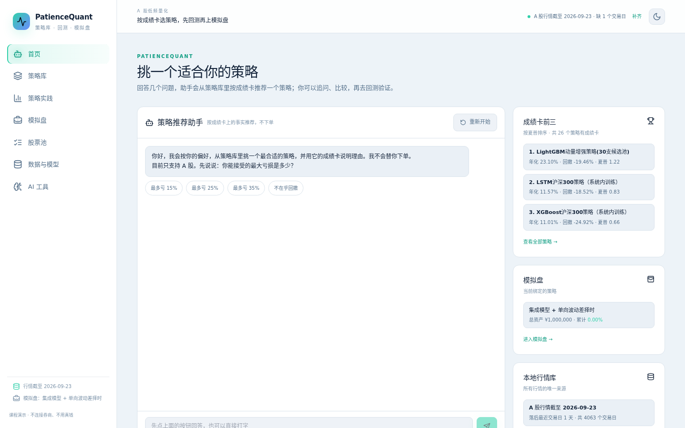 | 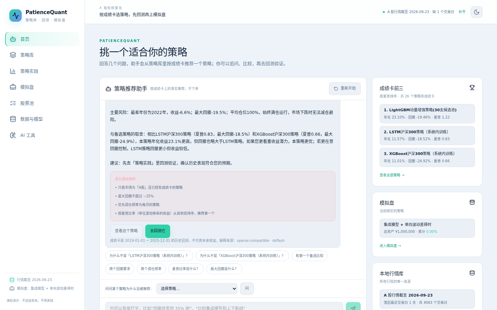 | 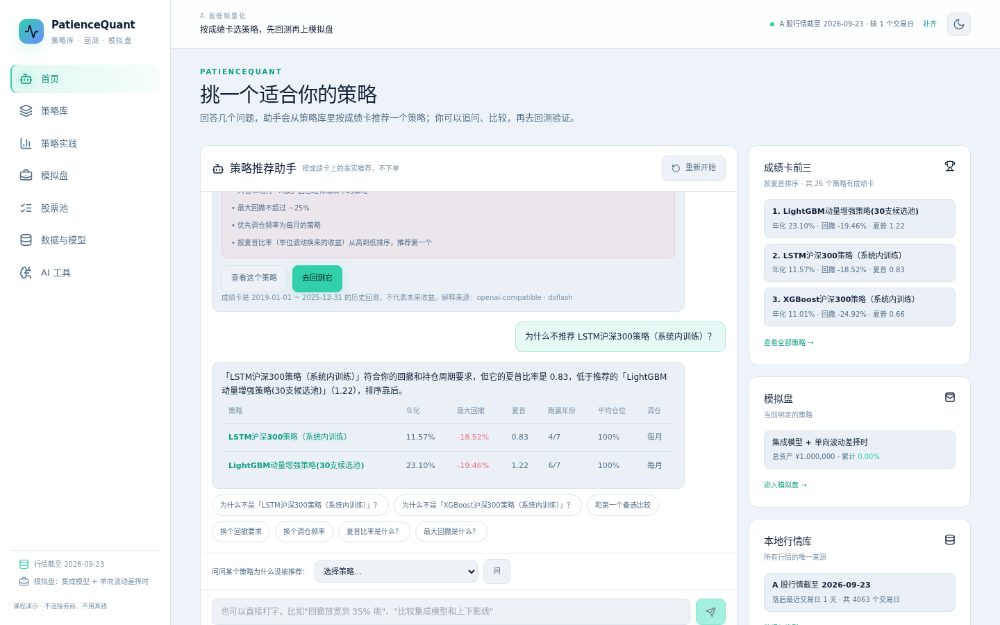 |

> 说明：这一步的三张截图来自第一次运行（数据与后续步骤相同），重跑其余步骤时沿用，避免重复调用大模型。

## 第 2 步：股票池、研究标注、股票池分析

**操作**：股票池 → 我的低频研究清单 → 点 600519 行的铅笔，填"所属板块/主题：白酒消费"和一段研究理由（**演示用示例文字**）→ 保存；往下看股票池分析。

**结果**：
- 标注保存成功。
- 股票池分析（2025-09-11 ～ 2026-09-23）：10 只股票等权组合 **+1.8%**，同期沪深300 **−0.7%**；成员收益中位数 −1.5%，上涨的成员占 40%。图表有行业分布、收益-波动散点、等权组合对沪深300 走势。

| 编辑标注 | 已保存 | 股票池分析 |
|---|---|---|
| 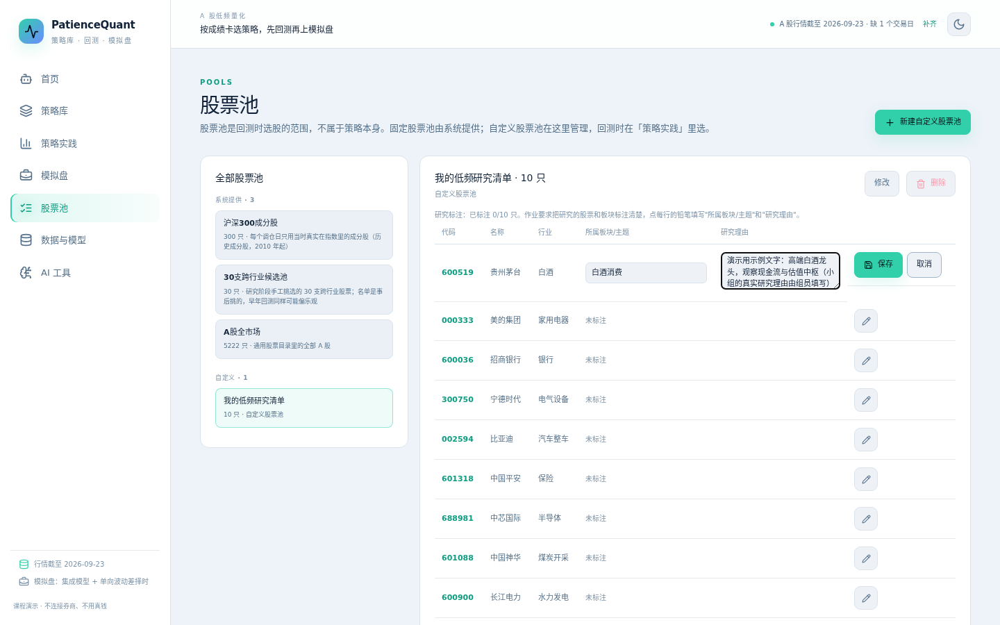 | 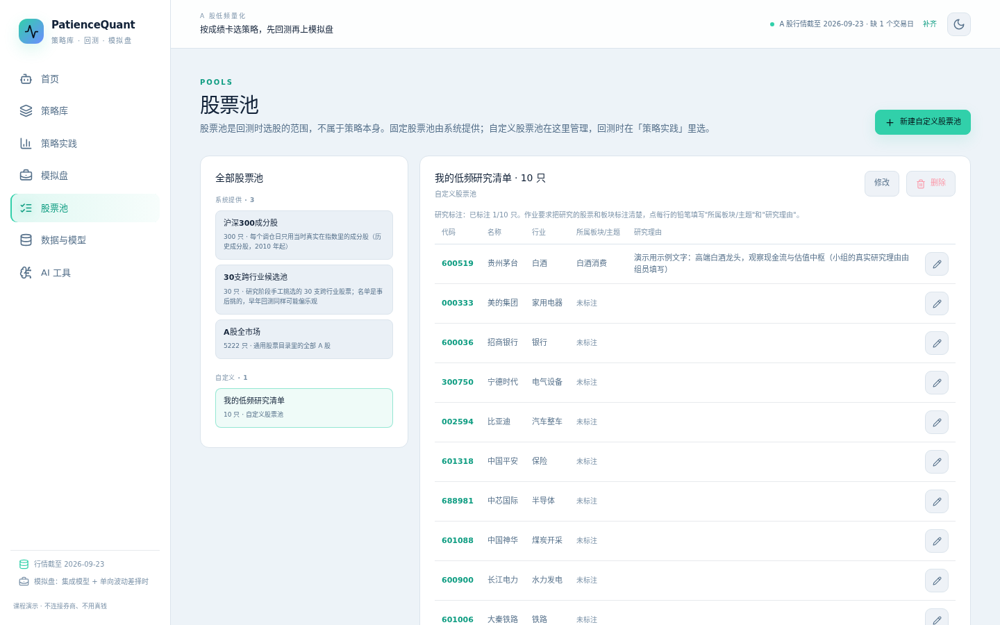 | 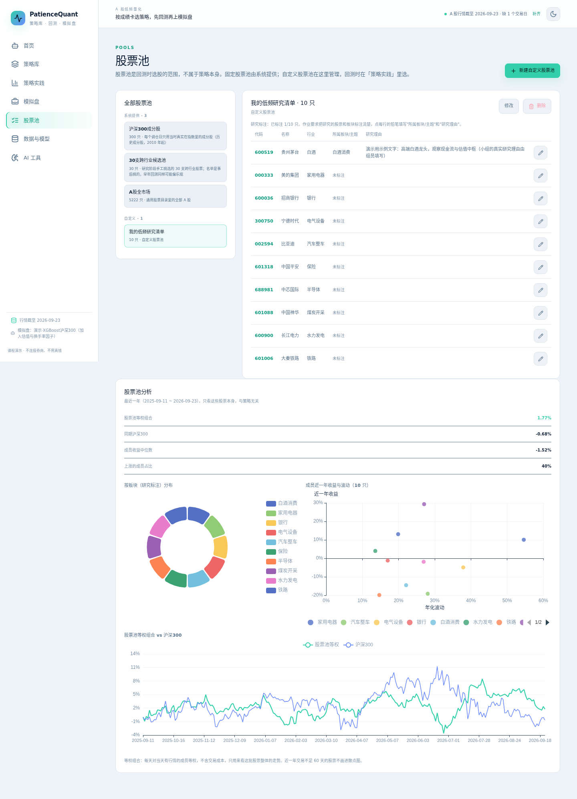 |

## 第 3 步：策略库

**操作**：打开策略库（默认按夏普排序），再把"打分方式"筛选为"模型"。

**结果**：26 个策略的成绩卡对比表（标准条件 2019–2025、100 万、默认股票池），筛选后只剩模型选股策略。

| 策略库 | 只看模型策略 |
|---|---|
| 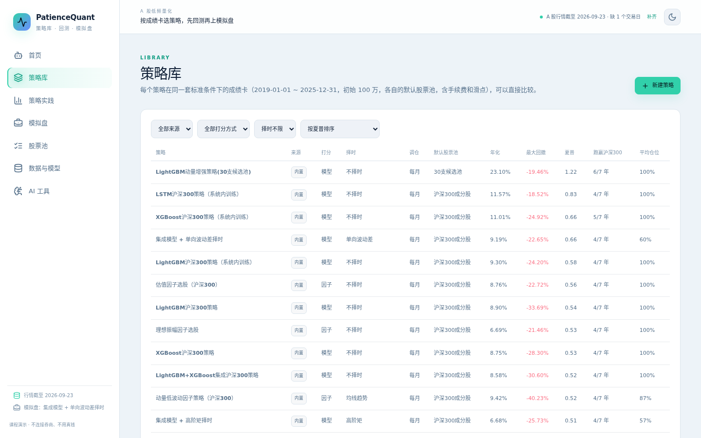 | 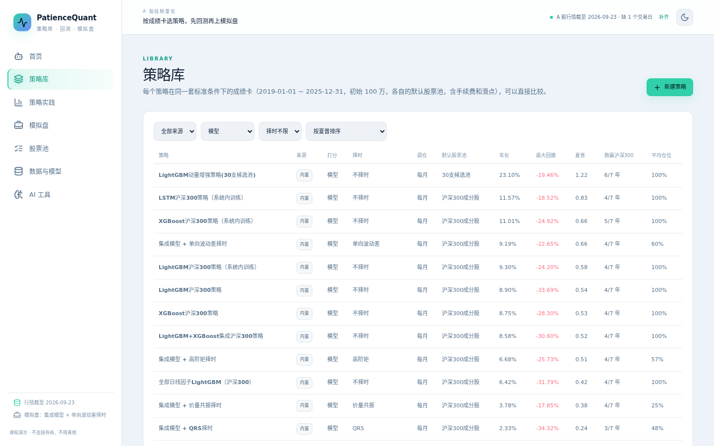 |

## 第 4 步：策略详情——用了哪几年的数据、赚了多少个点

**操作**：打开 LSTM沪深300策略（系统内训练）。

**结果**：
- 顶部数据说明：2019-01-01 ～ 2025-12-31 累计 **+109.2%（109 个点）**，同期沪深300 +55.9%。
- 行情来自本地行情库 A 股日线（2010 年起）。模型逐年滚动训练：给 2019 年打分的模型用 2010 年～2018 年 6 月底的样本，给 2025 年的用 2010 年～2024 年 6 月底的样本。
- 股票池每个调仓日只用当时的沪深300 成分股。
- 下面依次是成绩卡、打分模型的输入因子、逐年样本外 IC、逐年收益对沪深300。

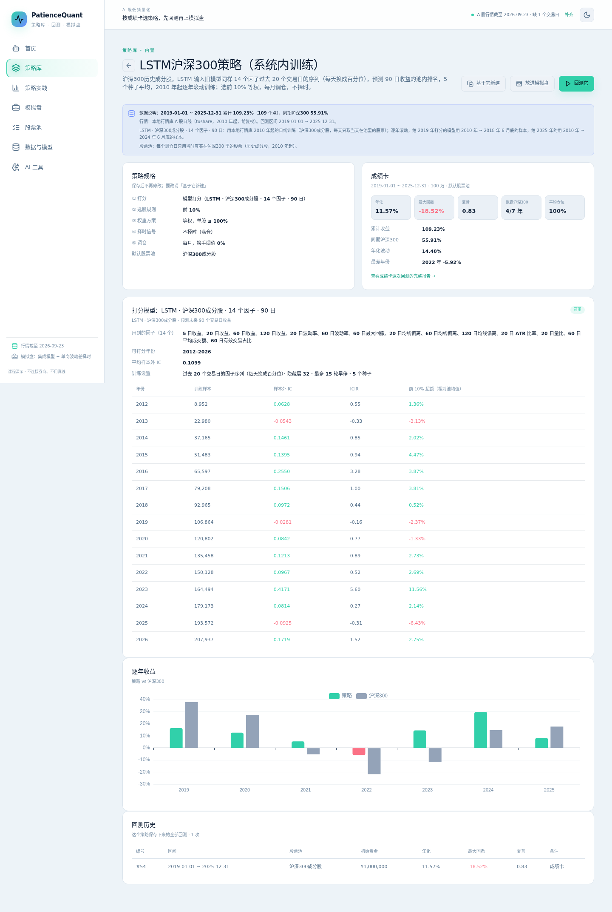

## 第 5 步：自己制定一个模型策略并训练

**操作**：策略库 → 新建策略：
- 名称"演示·XGBoost沪深300（加入估值与换手率因子）"；
- 打分选"模型预测"，算法 XGBoost，在默认 14 个因子上再点选"市净率"和"20 日平均换手率"（共 16 个）；
- 选前 10% 等权，每月调仓，不择时；
- 点"保存并训练"。

**结果**：策略立即保存，跳到它的详情页。打分模型显示"训练中"，输入因子列出全部 16 个。

| 填写训练设置 | 保存后，模型训练中 |
|---|---|
| 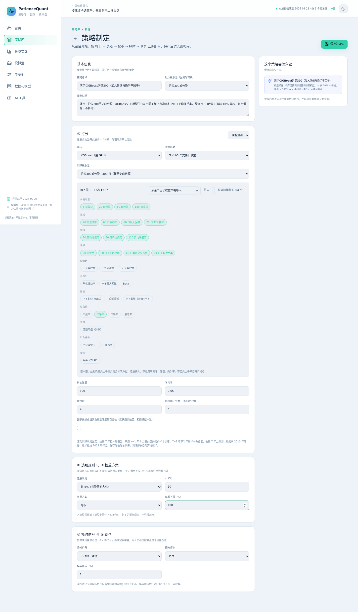 | 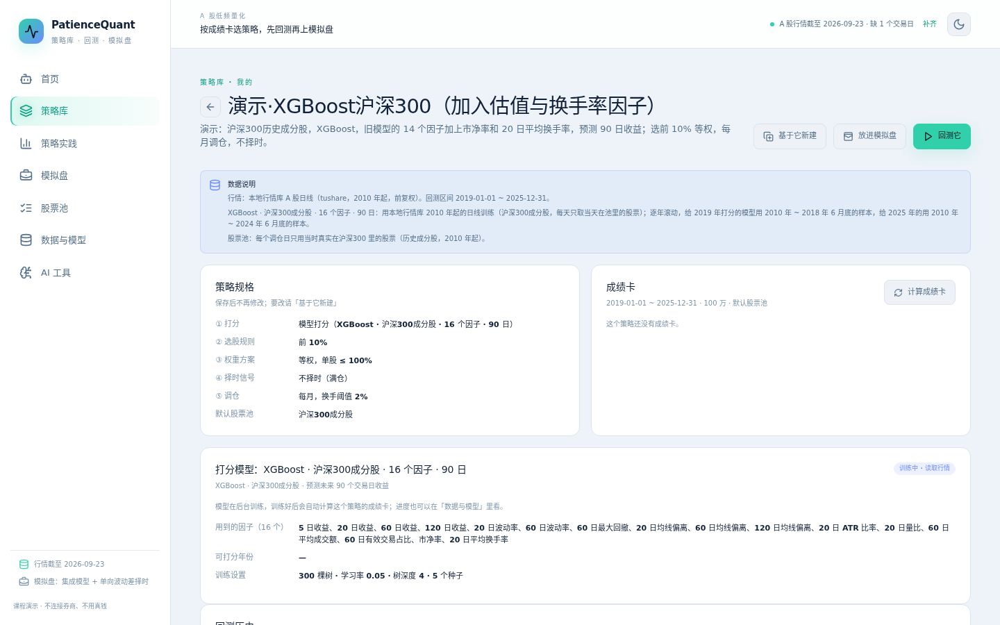 |

## 第 6 步：看训练进度和模型成绩

**操作**：数据与模型 → 模型库，看训练进度；训练完成后点开这个模型。

**结果**：
- 训练 **95 秒**完成，可以给 2012–2026 年打分，平均样本外 IC **0.053**。
- 展开后是逐年训练样本数、样本外 IC、ICIR、前 10% 超额收益。

| 训练中 | 训练完成，逐年样本外成绩 |
|---|---|
| 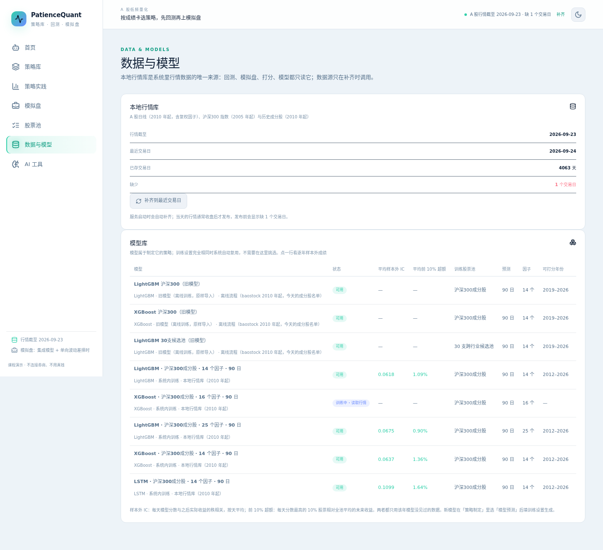 | 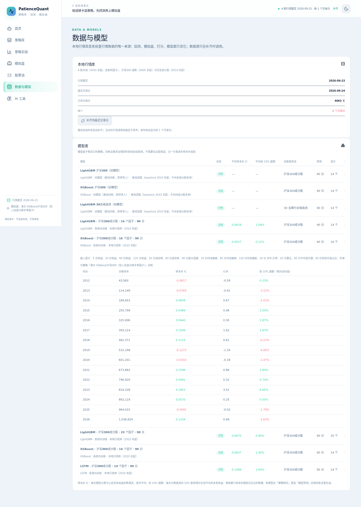 |

## 第 7 步：成绩卡自动算出 → 回测报告 → 解释一笔交易

**操作**：回到策略详情，成绩卡已经自动算好；点"查看成绩卡这次回测的完整报告"；在交易记录里点第一笔的"解释"。

**结果**：
- 成绩卡（2019–2025）自动算出：累计 +36.9%，年化 4.8%，最大回撤 −30.5%，夏普 0.34；同期沪深300 +55.9%。演示用的是默认训练设置，没有调参；成绩卡让不同因子组合的效果可以直接横向比较（例如和只用 14 个因子的同类模型对照）。
- 交易解释（按规则生成）："信号日 2019-01-31 收盘后按「演示·XGBoost沪深300（加入估值与换手率因子）」重新打分：光大银行 在 300 支有分数的股票里排第 1，分数 0.2597；这次选前 30 名，入选门槛分数 0.0957，它入选了，目标权重 3.3%。2019-02-01 以 2.78 元买入 12000 股（成交额 33,310 元）。"

| 新策略成绩卡 | 回测报告 | 交易解释 |
|---|---|---|
| 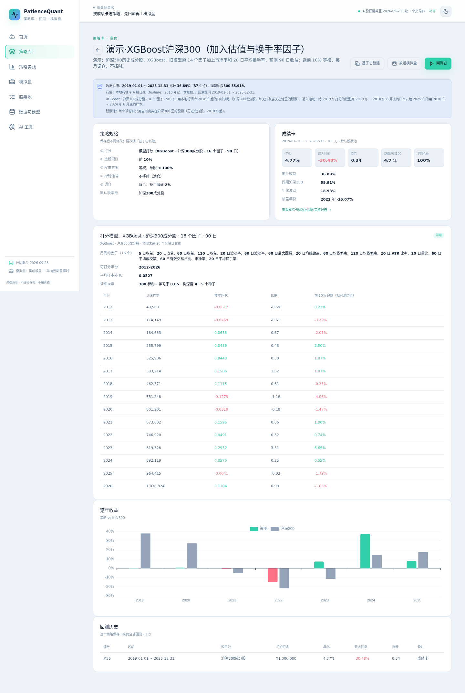 | 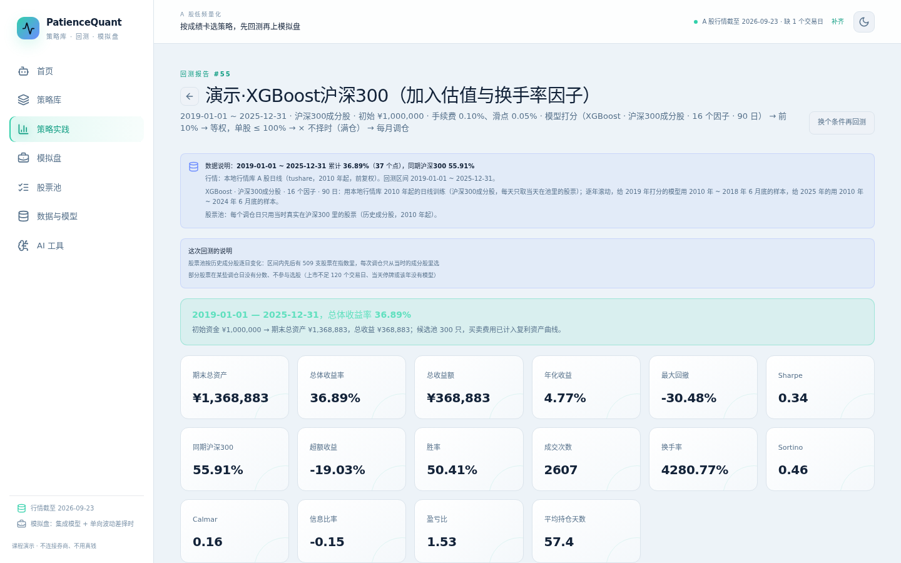 | 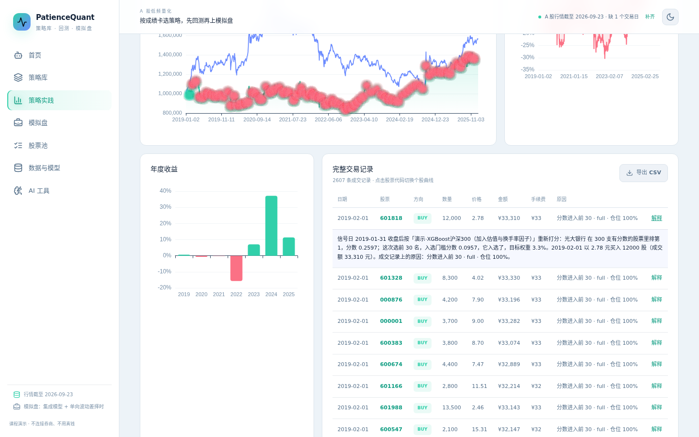 |

## 第 8 步：策略实践——换股票池和区间再回测

**操作**：策略实践 → 选这个策略 → 股票池换成"30支跨行业候选池"，区间点"最近两年" → 运行。

**结果**：2024-01-01 ～ 2025-12-31，累计 **+8.9%**，年化 4.5%，最大回撤 −19.2%，夏普 0.34；同期沪深300 +36.7%。这次回测保存为报告 #56，可以随时从回测历史调出。

| 换条件 | 新回测报告 |
|---|---|
| 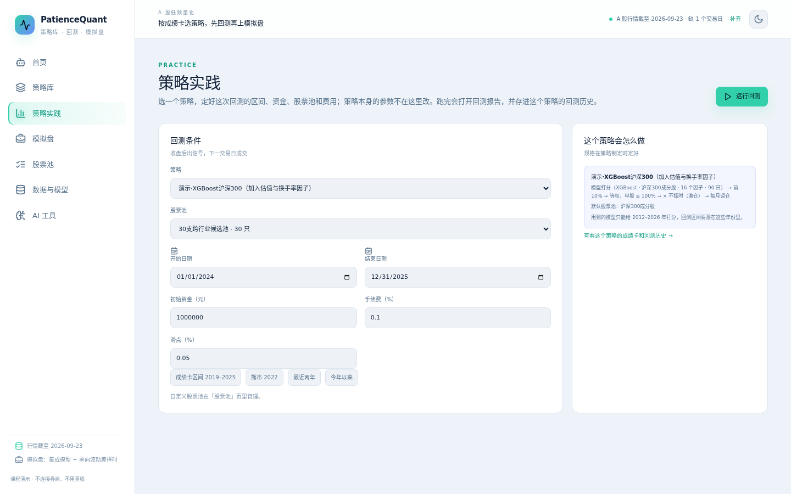 | 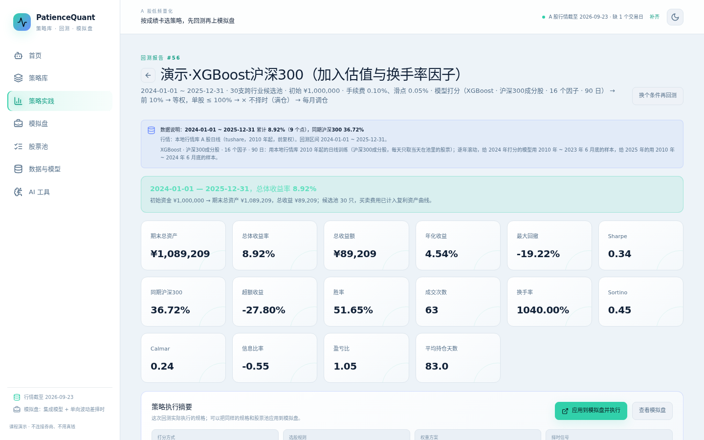 |

## 第 9 步：放进模拟盘，自动交易

**操作**：在策略详情点"放进模拟盘"并确认；模拟盘页自动调仓已开启；在交易账本里点第一笔的"解释"。

**结果**：
- 按 2026-09-23 收盘的打分调仓，买入 **30 只**，每只约 3.3 万元，持仓市值 ¥974,955，现金 ¥24,070，总资产 ¥999,025。差额是手续费和滑点，另外按 100 股一手取整会剩下一点零头。
- 自动调仓：每月执行，下次 2026-10-23。
- 订单解释："信号日 2026-09-23 收盘后按……重新打分：国联民生 在 298 支有分数的股票里排第 30……目标权重 3.3%。2026-09-23 以 8.65 元买入 3800 股。"

| 模拟盘（持仓、自动调仓、交易账本） | 订单解释 |
|---|---|
| 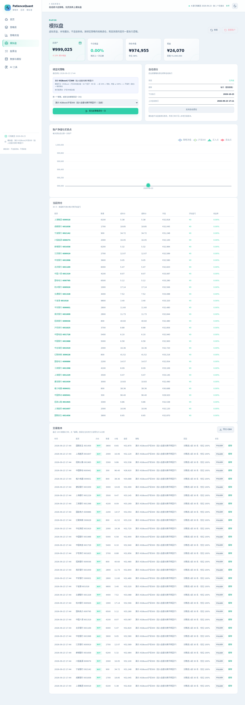 | 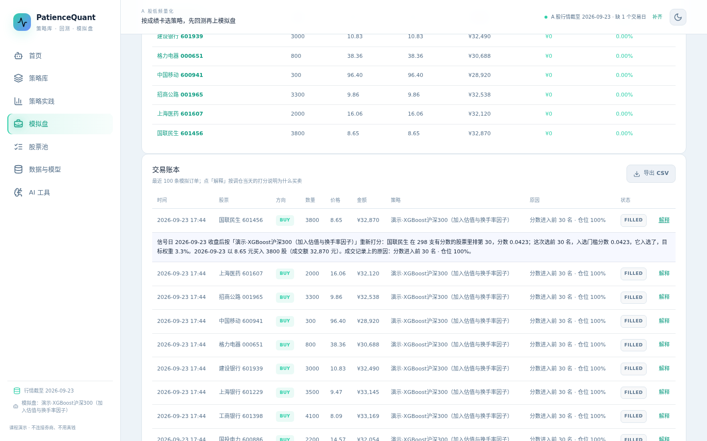 |

## 第 10 步：数据与模型

**结果**：本地行情库截至 2026-09-23，共 4,063 个交易日。当天（09-24）的行情收盘后才发布，所以显示"缺 1 个交易日"。模型库列出全部模型、状态和样本外成绩。

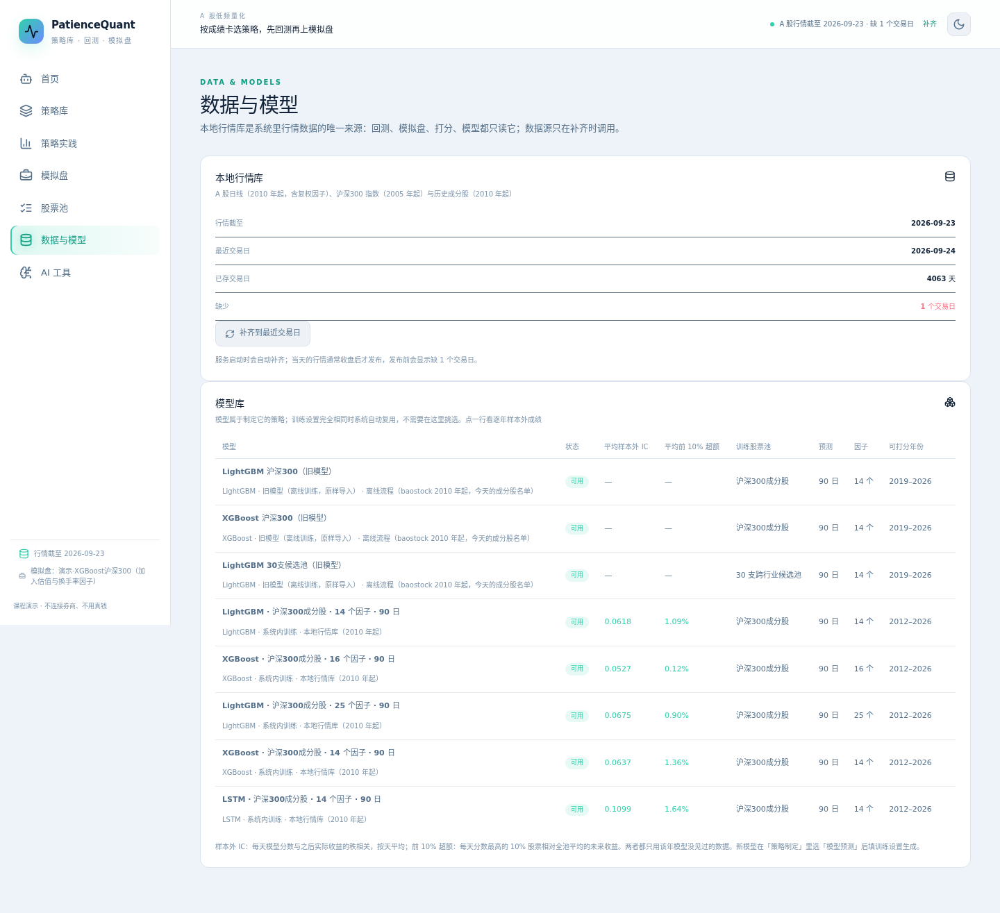
